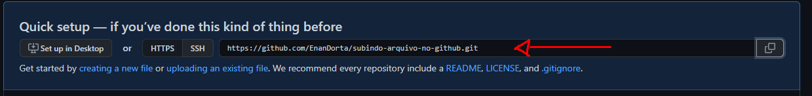

# Como subir arquivo no GitHub?
## Nesse tutorial estou deduzindo que você tem o git instalado na sua máquina, caso não tenha: [link download](https://git-scm.com/book/pt-br/v2/Come%C3%A7ando-Instalando-o-Git)
### Também vai ser preciso que você já tenha um repositório criado no seu perfil do GitHub
Aqui iremos fazer utilizando o terminal do git bash, já dentro da pasta que você deseja subir para o GitHub, essa vai ser a lista de comandos:

1. git init // Esse comando irá adicionar o git dentro da pasta, ou seja aqui começa o versionamento de código do Git.
2. git add . // Aqui todos os seus arquivos vão ser adicionados, e vão ficar staged, basicamente pronto para o commit.
3. git commit -m "first commit" // Aqui é onde criamos o nosso commit.
4. git branch -M main // Cria a branch Main no repositório
5. git remote add origin https://github.com/EnanDorta/subindo-arquivo-no-github.git // Faz a conexão com o git
6. git push -u origin main // Faz o push para a origin, no caso a url que passamos e no final é a branch que queremos enviar, no caso a main.

Aqui é onde conseguimos o link do exemplo 5.

  
  

